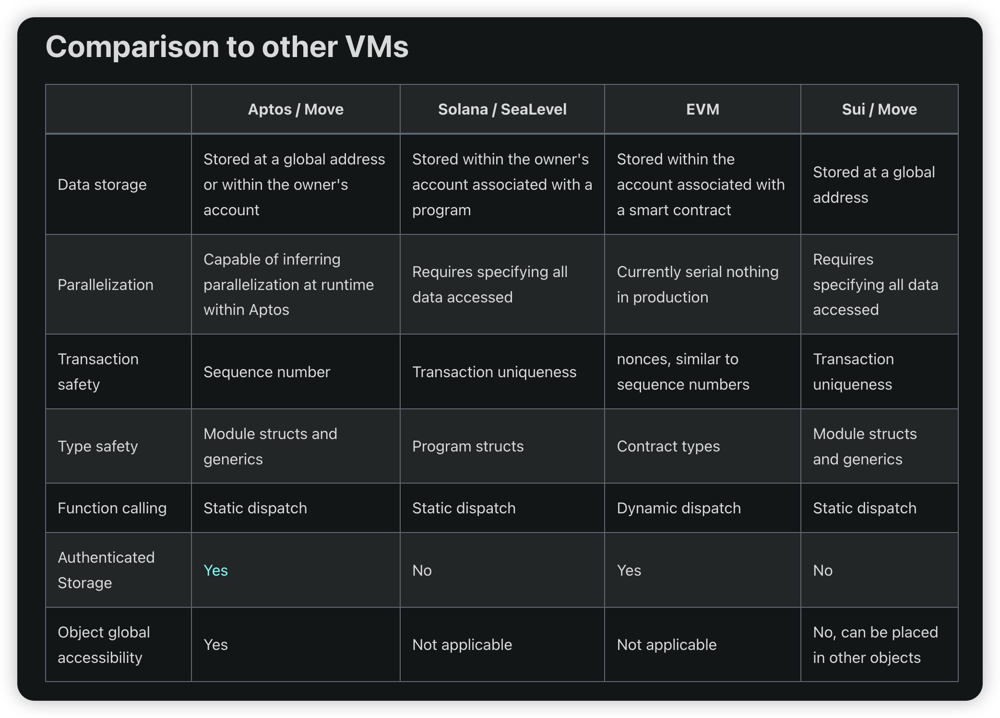
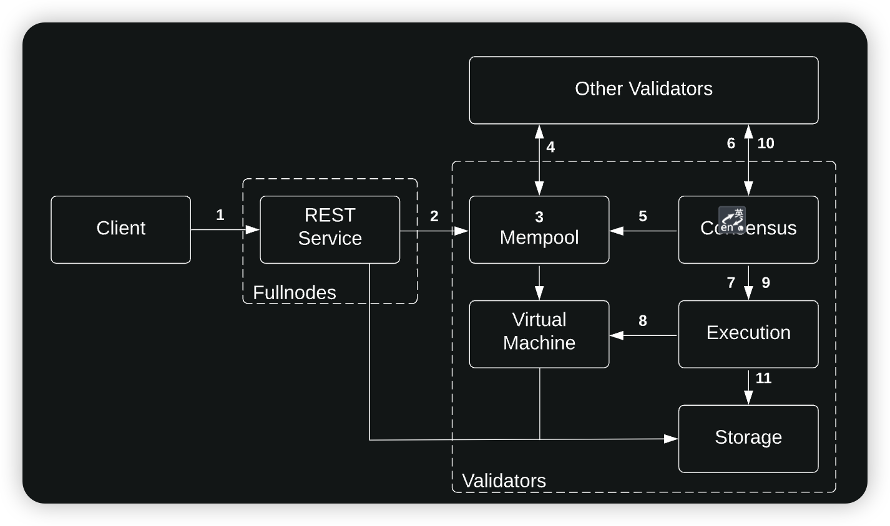
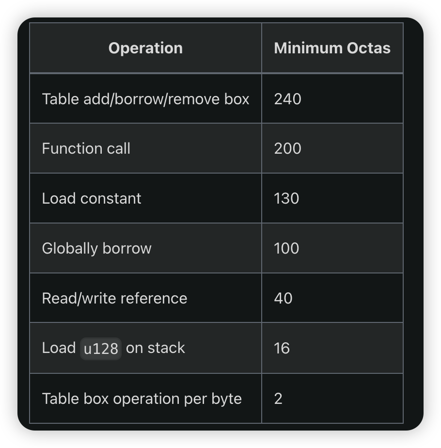
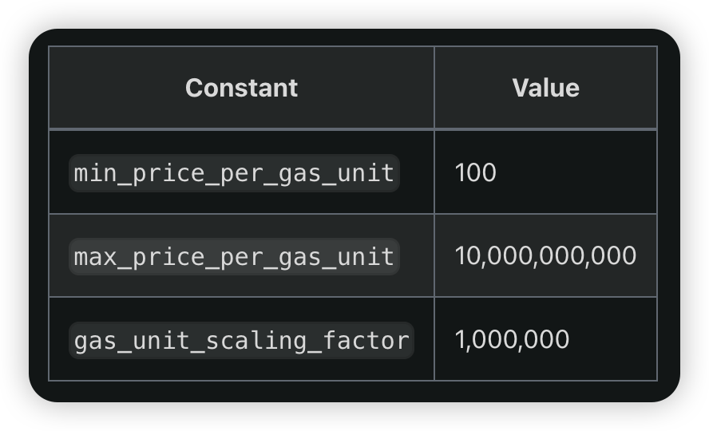
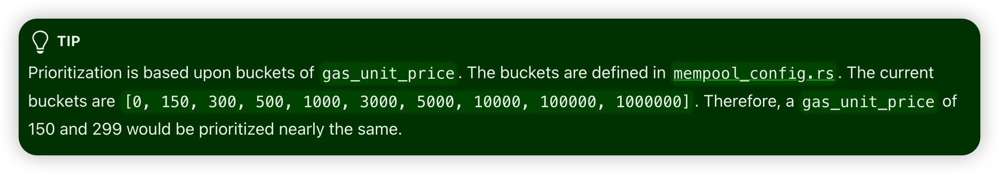

# Aptos

[Github Repo](https://github.com/aptos-labs/aptos-core)

[Official Docs](https://aptos.dev/)

### CLI 使用

- [install](https://aptos.dev/tools/aptos-cli/install-cli/)
    ```sh
    brew install aptos
    ```
- 初始化钱包
    ```sh
    aptos init
    ```
- dev环境 领水 (1 APT = 100,000,000 Octas)
    ```sh
    aptos account fund-with-faucet --account default
    ```

### Account

- 账户类型
    - 标准账户：用公私钥管理的账户
    - 资源账户：匿名账户没有对应的私钥，用于数据存储
    - 对象：单个地址中一组复杂资源的集合
- 32bytes hex string (len = 64), prefixed with 0x
- keypair 创建
    - Ed25519 (default)
    - Secp256k1 ECDSA
    - 原生支持的多签
    - Legacy - MultiEd25519
    - Generalized authentication prefix indicate key type
        - 0x00 Ed25519
        - 0x01 Secp256k1 ECDSA
    - Derive 32bytes auth key:
        - auth_key = sha-256(pubkey | 0x00)
        - auth_key = sha-256(0x01 | pubkey | 0x02)
- Sequence Number (SN)
    - 类似 EVM 链的 nounce
    - 只有当 SN 大于等于当前链上该账户的 SN 时，交易才会被验证为有效
    - SN 尽量保证连续性，否则可能会导致交易失败

### Move

- Move 是 Aptos 网络的底层开发语言，其运行时 MoveVM 和其他 XVM 的比较



- Move module
    - 包含代码和类型声明，类似于 Solana 程序账户 / EVM contract Implementation (eg: ERC1967)
- Move resources
    - 承载了具体数据，类似 Solana 的数据账户 / EVM proxy contract

### Transaction

- lifecycle
    
    
    
- 一笔交易的组成部分
    - signature, 私钥拥有者对交易的签名
    - sender address, 交易发起者的账户地址
    - sender pubkey, 公钥
    - payload, 类似 EVM input data
    - gas unit price + maximum gas amount, 类似 EVM gas price 和 gas limit
        - gas 消耗 = gas price * units of gas required
    - sequence number, 类似 EVM 链的 nounce
    - expiration time, 过期时间，类似solana recentBlockHash，EVM没有类似概念但是 txpool 一旦满了就会清理陈旧的低gas交易，故而交易也有过期的时候，但有时候会等较长时间

### Gas

- gas组成
    - 执行 & IO 操作
    
    
    
    - 储存
        - 按照大小固定消耗，释放后目前会等额重新 mint 并 refund
- gas 最终计算公式：gas_used * gas_unit_price - storage_refund
- gas estimate (https://aptos.dev/concepts/gas-txn-fee/#simulation-steps)
    
    
    
    - 调用 [Simulate Transaction](https://api.devnet.aptoslabs.com/v1/spec#/operations/simulate_transaction) RPC 或者本地模拟，得出固定交易所需的 gas_used
    - 调用 [Estimate Gas Price](https://api.devnet.aptoslabs.com/v1/spec#/operations/estimate_gas_price) RPC 获取 gas_unit_price 的估算值
    - 对比 prioritization buckets，得出最优解的 gas_unit_price
    
    
    
    - 通过 gas_used * 1.5 (安全系数)，得出 max_gas_amount
- 每笔交易最低gas要求：150W个内部单位，即 15000 octas；超过600字节后，每字节增长费用不低于 20 octas