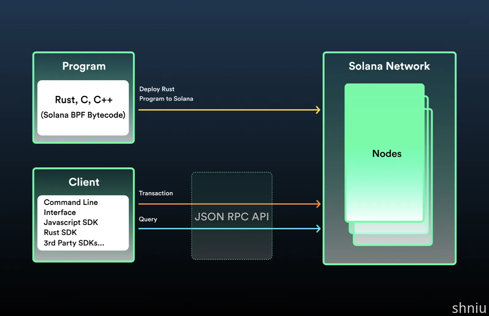

# Solana

## 前言

最近在了解 Solana 区块链，相比于 Ethereum，它们之间的差异性还是很明显的，所以很有必要做个梳理和备忘。Solana 链近期很火爆，很有必要深入学习。

> https://solana.com/
>
> Solana is a decentralized blockchain built to enable scalable, user-friendly apps for the world.

Solana 理论上每秒可处理的交易 (TPS) 高达 50000 笔，区块达到最终确认的时间仅需约 400 毫秒。 Solana 的终极目标，是证明可以让区块链的交易吞吐量随网络频宽按比例扩张，实现可快速扩充、安全、去中心化的三大特质。

**lamports** is the smallest unit in the Solana network, 1 **SOL** is equal to 1,000,000,000 **lamports**. The name of **lamports** is in honour of Solana's biggest technical influence, [Leslie Lamport](https://en.wikipedia.org/wiki/Leslie_Lamport).  (1 SOL = 10^9 lamports)

Solana is a blockchain built for mass adoption. It's a high performance network that is utilized for a range of use cases, including finance, NFTs, payments, and gaming. Solana operates as a single global state machine, and is open, interoperable and decentralized. (Solana 是一个专为大规模采用而构建的区块链。 它是一个高性能网络，可用于一系列用例，包括金融、NFT、支付和游戏。 Solana 作为单一的全球状态机运行，并且是开放的、可互操作的和去中心化的。)

简言之，Solana 是一个类似于 Ethereum 的功能强大、支持智能合约、去中心化、开放的区块链网络，目前被广泛使用。

### 基本信息

通过下面的表格可以了解一些 Solana 的基本信息，关于共识机制不是这次讨论的重点，暂不做过多解释。

| Official Site              | [https://solana.com/](https://solana.com/zh)                 |
| :------------------------- | ------------------------------------------------------------ |
| White Paper                | https://solana.com/solana-whitepaper.pdf                     |
| Consensus                  | DPoS & PoH                                                   |
| Features                   | High Performance                                             |
| Block Time                 | 400 ms                                                       |
| Confirmation No.           | 1                                                            |
| Coin                       | SOL                                                          |
| Unit                       | lamports                                                     |
| Precision                  | 10^9  (1 SOL = 10^9 lamports)                                |
| Address case-sensitive     | Yes                                                          |
| Address regular expression | ^[1-9A-HJ-NP-Za-km-z]{32,44}$                                |
| Token Support              | Yes (SPL Token)                                              |
| Program or Smart Contract  | Yes, written by Rust                                         |
| RPC Endpoints              | Custom  net  solana-test-validator <br />Devnet [https://api.devnet.solana.com](https://api.devnet.solana.com/) <br />Testne t[https://api.testnet.solana.com](https://api.testnet.solana.com/)<br />Mainnet (Beta)<br /> [https://api.mainnet-beta.solana.com](https://api.mainnet-beta.solana.com/)[https://solana-api.projectserum.com](https://solana-api.projectserum.com/)<br />@see https://docs.solana.com/cluster/rpc-endpoints |
| Explorer                   | [http://explorer.solana.com/](https://explorer.solana.com/)<br />[http://solana.fm/](https://solana.fm/)<br />[http://solscan.io/](https://solscan.io/)<br />http://solanabeach.io/<br />http://validators.app/ |
| Testnet Explorer           | https://explorer.solana.com/?cluster=testnet                 |
| 加密算法                   | ed25519                                                      |
| 公钥 / 地址                | public key in base58                                         |

## Core Concepts



Solana 区块链的基本组成如上，分为 Solana Netowrk, Solana Client, Solana Program (Native Program & On-Chain  Program)：

- 合约的开发者使用 Rust / C / C++ 等语言开发智能合约，并部署在 Solana Network 上；一旦部署到区块链上，任何想与之交互的人都可以使用 Solana 的 Client SDK or JSON RPC API 进行通信
- Client 端的开发者或用户可以使用 JSON RPC API 与 Solana Network 交互，基于 SDK 进一步可以封装出 dApp 应用、Wallet 等，提供给大多数的用户使用


**Note:** 如果想快速的了解 Solana 可以看这个中文教程 [Solana中文开发教程](https://www.solanazh.com/) 的 Week1, Week2, Week3 ...


Solana 提供了三套运行中的环境，分别是 `devnet`, `testnet`, `mainnet beta`，其中 `devnet`, `testnet` 可以用作开发测试，`mainnet beta` 是生产网络；此外，也可以运行一个本地环境，用做开发环境等。具体的集群信息可以看这里 [Clusters and Public RPC Endpoints](https://solana.com/docs/core/clusters)

如果你想运行一个本地环境，可以看 [Setup local development and install the Solana CLI](https://solana.com/developers/guides/getstarted/setup-local-development)

做完上面的教程，在本地就会有 `solana` 相关的命令，我们可以使用 cli 很方便的跟 `devnet`, `testnet`, `mainnet beta` 进行交互了。

比如

```shell
# 查看一些默认配置
$ solana config get
Config File: /Users/user/.config/solana/cli/config.yml
RPC URL: https://api.devnet.solana.com
WebSocket URL: wss://api.devnet.solana.com/ (computed)
Keypair Path: /Users/user/.config/solana/id.json
Commitment: confirmed

# 查看默认的地址
$ solana address
B3HSvqGvWVCppZh6A7g7ga94eZS4DRFQNFTPi65f8snc

# 查看默认地址的 SOL 余额
$ solana balance
10.61167344 SOL

# 还可以请求一些测试币
$ solana airdrop 1
Requesting airdrop of 1 SOL

Signature: 49LLAvowZSPybPacZ9g664h2CPX2B45pxXBknhkKnDccpNxo9gMoweqecEfiTuFi81BvVXYKFuSxQv3dBrUeGWhV

11.61167344 SOL

...
```

### 本地启动 Solana test validator

[Install the Solana Cli](https://docs.solanalabs.com/cli/install) 可以安装本地的 Solana 相关命令。

```shell
# 启动一个本地的 Solana 测试节点
$ solana-test-validator

# 把 solana 命令连接到本地的 RPC 节点
$ solana config set --url http://127.0.0.1:8899

# 也可以重新连接到其他节点，比如 devnet / testnet / mainnet
$ solana config set --url https://api.devnet.solana.com
$ solana config set --url https://api.testnet.solana.com
$ solana config set --url https://api.mainnet-beta.solana.com

# Verify the CLI Tool Suite configuration
$ solana genesis-hash

# Airdrop some test tokens
$ solana airdrop 100

# Query the balance
$ solana balance 

# Next
$ solana transfer ...
```

详细的可以参考这里 [Local Development](https://solanacookbook.com/references/local-development.html#starting-a-local-validator) or [Solana Test Validator](https://docs.solanalabs.com/cli/examples/test-validator)

### Keypair

Solana 使用 Public Key 作为 地址，准确来说是 Public Key 的 base58 编码，算法使用 ed25519，这是一个 Solana Wallet 的基础。

- Public Key 长度 32 bytes，256 bit
- Private Key 长度 64 bytes
- ed25519 signature 长度 64 bytes
- 签名算法 ed25519
- Private key 的存储形式
  - 本质是一个大数，并且可以用 byte 序列的形式表示，512 bits
  - bytes
  - base58
  - hex
  - 助记词推导 (核心思想是 seed): bip39, bip44

- Address 是 Public Key 的 base58 编码形式
  - HD Address


```go
// PK 是 private key bytes
_, PK, _ := ed25519.GenerateKey(nil)
if len(PK) != ed25519.PrivateKeySize {
  painc(errors.New("key length mismatch"))
}

// ed25519 的 公钥和私钥
priKey := ed25519.PrivateKey(key)
pubKey := priKey.Public().(ed25519.PublicKey)

address := base58.Encode(pubKey)
fmt.Println(address)
```


详细内容可以参考 [keyparis and wallets](https://solanacookbook.com/references/keypairs-and-wallets.html#how-to-generate-a-new-keypair)

### Account Model

在 Solana 区块来链中流传着一句话：`Everything is an Account` ，怎么理解呢？


从 Solana 的账户层级开始，首先在 Solana 中一切皆账户，这个跟在 Linux 一切皆文件很类似，账户本身又有不同维度的控制，比如是否可执行，lamports 的余额等。


系统级别的账户

用户级别的账户


通过发行 SPL Token 来加深对 Account 的理解


三种类型的账户

- 数据账户存储数据
  - 系统拥有的账户
  - PDA (Program Derived Address) 账户
- 程序账户存储可执行程序
- 原生账户是 Solana 上的原生程序，包括 System, Stake, Vote

每个账户都包含如下字段

- lamports - 当前账户的 sol 余额
- owner - 当前账户归属的程序账户
  - This field stores the address of an on-chain program and represents *which* on-chain program is allowed to *write* to the account’s data and subtract from its lamport balance. (该字段存储链上程序的地址，表示允许哪个链上程序写入账户数据并从其 lamports 余额中减去)
- executable - 当前账户是否是可执行的，只有程序账户才是 true
- data - 当前账户存储的原始数据，对于数据账户存储的是数据状态，而对于程序账户存储的是 executable code 或者一个指向存储了 executable code 的账户代理地址
- rent_epoch

规则

1. 只有数据账户的 owner 可以修改自己的数据和 lamports
2. 程序账户不存储状态

为了确保一个合约不能修改其他合约的账户数据，每个账户都被指定一个 owner，这个 owner 执行特定的程序，这样当程序账户在执行时就可以来确定它是否可以修改指定数据账户的数据部分和lamports；

由于可执行的程序账户是不可修改的，所以他们的数据状态需要存储在一些独特的可修改的数据账户中; Developers can create new accounts with an assigned owner equal to the address of their executable account to store data.


Account Owner

每个账户都有一个指定的 owner，由于账户可以被创建并接收 sol，所以账户必须在创建时指定一个默认的 owner；在 Solana 中有个一称作 System Program 的默认 owner，它主要作用就是创建账户和转移 lamports

类型

- Sysvar - owner is Sysvar，用于加载区块状态，比如最近区块、当前的租金费用等
- Native Program - owner is Native Loader, 用于表明原生程序，比如System、Stake、Vote 程序等
- BPF Program - owner is BPF Loader, 用于处理 BPF 字节码 (也就是用户部署的链上合约或者叫 program)


[Account Model](https://solana.wiki/zh-cn/docs/account-model/#account-storage)


### Transactions

在 Solana 区块链上，transaction 是最小的执行单元，program 的执行开始于提交到 Solana Cluster 的交易；每个交易由若干个 instructions 构成，这些 instructions 按序自动的被执行，如果某个 instruction 执行失败，整个交易都会失败。

任何对链上的修改都需要借助 Transaction，它是指令的集合，用于执行链上程序，交易是原子性的。

每个指令包含：

1. 读取和/或写入的账户数组，每笔交易都声明了会涉及到哪些账户，如果多个交易影响的账户是不同的，那么这些交易就可以并行处理，以提升处理速度
2. 要调用的程序的 public key
3. 程序执行需要的数据，一般以字节数组组织，称作 instruction data, 它是特定于 program 的，也就是说不同的 program 对于 data 部分的解读也是不一样的


每个签名的长度是 64 bytes，账户地址的长度是 32 bytes


[Serialize instruction data](https://www.soldev.app/course/serialize-instruction-data)

Exactly *how* this data would be structured would depend on how the program was written, **but it’s common to have the first field in instruction data be a number that the program can map to a function, after which additional fields act as function arguments**.

instruction data 序列化的通用做法是使用一个数字放在最前边，用来映射链上程序的功能函数，后续的数据作为函数参数。
solana 中最常用的序列化方式是 [borsh](https://borsh.io/) 


#### Deep into transaction

Solana 的 transaction 有两类：Legacy transaction 和 Versioned transaction。

- Legacy transaction 的缺陷是，由于每个交易的最大字节数是 1232 bytes，会导致地址一个原子交易中能包含的最大地址数是 35 个，从这个来看，对交易指令的大小以及涉及到的地址数是有限制的

```go
// transaction struct
type Transaction struct {
  signatures [][]byte
  message Message
}

```


## Solana JSON RPC

交易状态保证，划分了几个等级

- finalized 
- confirmed
- processed

confirmed 可以平衡速度和安全性，finalized 是更加安全的级别。如果没有配置，默认是 finalized。

RpcResponse 结构分为两部分：context 和 value

某些方法支持 encoding 参数，可以返回 account 


在 Solana 中，slot 类似于 block height 的概念，可以等同使用

- getSlot - 返回到达了给定的 commitment 级别的最新 slot
- getBlock - 根据 slot 获取 block 信息，可以指定 commitment, encoding，返回值包括 transactions 列表
  - 获取 txHash: $.transactions[i].transaction.signatures[0]
  - 判断状态：$.transactions[i].meta.err  or  $.transactions[i].meta.status { Err | Ok}
  - $.transactions[i].meta.preBalances[]  数组是交易处理之前的账户余额
  - $.transactions[i].meta.postBalances[]  数组是交易处理之后的账户余额
  - $.transactions[i].transaction.message.accountKeys[] 数组是 pubkeys
  - preBalances.length == postBalances.length == pubkeys.length
  - $.transactions[i].meta.preTokenBalances[]
  - $.transactions[i].meta.postTokenBalances[]


## 实践

### Transfer SOL

开发一个钱包，最基础的功能就是做 transfer，我们使用 Go 来实现 SOL 资产的转移

```go
c := client.NewClient(rpc.DevnetRPCEndpoint)
response, err := c.GetLatestBlockhash(context.TODO())
if err != nil {
  panic(err)
}

tx, err := types.NewTransaction(types.NewTransactionParam{
  Signers: []types.Account{wallet, wallet},
  Message: types.NewMessage(types.NewMessageParam{
    FeePayer:        wallet.PublicKey,
    RecentBlockhash: response.Blockhash,
    Instructions: []types.Instruction{
      system.Transfer(system.TransferParam{
        From:   wallet.PublicKey,
        To:     common.PublicKeyFromString(targetAddress),
        Amount: 1e6, // 0.001 SOL
      }),
    },
  }),
})
```

[System Program Instructions](https://docs.rs/solana-program/latest/solana_program/system_instruction/index.html) , and here is [code](https://docs.rs/solana-program/latest/src/solana_program/system_instruction.rs.html#1-1802) [github system_instruction.rs](https://github.com/solana-labs/solana/blob/v1.18.9/sdk/program/src/system_instruction.rs)


### SPL Token

首先，SPL Token 类似于 Ethereum 里的 ERC20 Token 和 ERC721 Token，它是 Solana 区块链中特有的概念，SPL Token 是一个由 Solana Labs 开发的 On-Chain Program (Smart Contract)，并且由 Solana Labs 部署在区块链上供其他人使用，也可以说 SPL Token 就是 Solana 的 Token 标准。

几个概念

- SPL Token - 代表了 Solana 网络上的非原生代币，包括同质化和非同质化
- Token Program - 包含了创建以及和 SPL Token 交互的一组指令
- Token Mint - 持有特定 Token 数据但不持有代币的账户，这是一个数据账户
- Token Account - 持有特定 Token Mint 的账户，在创建 Token Account 的时候需要 SOL 来支付租金，但是当账户注销关闭后，租金会退还；但 Token Mint 目前无法注销


token program 是 SPL 提供的众多程序之一，包含了创建和与 SPL-token 交互的指令，这些代表 Solana 网络上的所有非原生代币

1. Create token: `spl-token create-token` , 得到 token identifier，也叫 Mint 地址，用作某个代币的合约地址；所以，在 Solana 上 token program 只有一份，是由 Solana Labs 部署在 Solana 区块链上的

mint address 的 owner 是 Token Program (**TokenkegQfeZyiNwAJbNbGKPFXCWuBvf9Ss623VQ5DA**) 

SPL-Token 转移需要发送方和接收方都拥有要转移的代币铸造厂的 Token 账户；代币从发送方的 Token 账户转移到接收方的 Token 账户；当获取接收方的关联Token账户以确保其在转移前存在时，您可以使用`getOrCreateAssociatedTokenAccount`。只需记住，如果账户尚不存在，则此函数将创建它，交易付款人将扣除所需的账户创建的lamports。

2. Token 账户

Token Mint 账户创建完成后，需要创建一个 Token 账户来持有新发行的代币


PDA

PDAs 是结合程序地址和开发者选择的一些种子，以创建存储单个数据片段的地址。由于 PDAs 是位于 Ed25519 椭圆曲线之外的地址，因此 PDAs 没有私钥。相反，PDAs 可以通过用于创建它们的程序地址进行签名。


#### 关于 Associated Token Account Program ([ATA](https://spl.solana.com/associated-token-account))

ATA 是一种将钱包地址映射到关联的某个 token 账户的机制，主要作用简化了 Token Account 的维护。

从理论上来讲，一个用户针对某个 `token mint` 可以拥有任意多个 token accounts，这就引入了一个非常麻烦的事情，在发送 token 时我们很难知道其他人的 token account 是什么，从而为 token 管理引入了很多麻烦；ATA 引入了一种确定性的推导 token account 的机制，只需要使用用户的 System 账户地址和 token mint 地址结合在一起，确定性的创建一个 token account 出来，我们叫这类账户为关联 token 账户

此外，这种方式也允许在接收人没有某个 token mint 的 token account 时，也可以接收到 token；不像系统转账，token 转账时接收人必须有跟这个 token mint 相关的 token account，否则无法转账成功

ATA 的生成方式

```go
var TokenProgramID = PublicKeyFromString("TokenkegQfeZyiNwAJbNbGKPFXCWuBvf9Ss623VQ5DA")
var SPLAssociatedTokenAccountProgramID = PublicKeyFromString("ATokenGPvbdGVxr1b2hvZbsiqW5xWH25efTNsLJA8knL")

func FindAssociatedTokenAddress(walletAddress, tokenMintAddress PublicKey) (PublicKey, uint8, error) {
	seeds := [][]byte{}
	seeds = append(seeds, walletAddress.Bytes())
	seeds = append(seeds, TokenProgramID.Bytes())
	seeds = append(seeds, tokenMintAddress.Bytes())

	return FindProgramAddress(seeds, SPLAssociatedTokenAccountProgramID)
}
```


需要了解细节，可以看代码，[ATA Program 在这里](https://github.com/solana-labs/solana-program-library/blob/master/associated-token-account/program/src/entrypoint.rs)

```rust
/// Instructions supported by the AssociatedTokenAccount program
#[derive(Clone, Debug, PartialEq, BorshDeserialize, BorshSerialize, BorshSchema)]
pub enum AssociatedTokenAccountInstruction {
    /// Creates an associated token account for the given wallet address and
    /// token mint Returns an error if the account exists.
    ///
    ///   0. `[writeable,signer]` Funding account (must be a system account)
    ///   1. `[writeable]` Associated token account address to be created
    ///   2. `[]` Wallet address for the new associated token account
    ///   3. `[]` The token mint for the new associated token account
    ///   4. `[]` System program
    ///   5. `[]` SPL Token program
    Create,
    /// Creates an associated token account for the given wallet address and
    /// token mint, if it doesn't already exist.  Returns an error if the
    /// account exists, but with a different owner.
    ///
    ///   0. `[writeable,signer]` Funding account (must be a system account)
    ///   1. `[writeable]` Associated token account address to be created
    ///   2. `[]` Wallet address for the new associated token account
    ///   3. `[]` The token mint for the new associated token account
    ///   4. `[]` System program
    ///   5. `[]` SPL Token program
    CreateIdempotent,
    /// Transfers from and closes a nested associated token account: an
    /// associated token account owned by an associated token account.
    ///
    /// The tokens are moved from the nested associated token account to the
    /// wallet's associated token account, and the nested account lamports are
    /// moved to the wallet.
    ///
    /// Note: Nested token accounts are an anti-pattern, and almost always
    /// created unintentionally, so this instruction should only be used to
    /// recover from errors.
    ///
    ///   0. `[writeable]` Nested associated token account, must be owned by `3`
    ///   1. `[]` Token mint for the nested associated token account
    ///   2. `[writeable]` Wallet's associated token account
    ///   3. `[]` Owner associated token account address, must be owned by `5`
    ///   4. `[]` Token mint for the owner associated token account
    ///   5. `[writeable, signer]` Wallet address for the owner associated token
    ///      account
    ///   6. `[]` SPL Token program
    RecoverNested,
}
```


## SDK

- [Rust]()
- Golang
  - https://github.com/gagliardetto/solana-go - Go SDK library and RPC client for the Solana Blockchain, there is currently **no stable release**.
  - https://github.com/blocto/solana-go-sdk - https://blocto.github.io/solana-go-sdk/
- Java
  - https://github.com/sol4k/sol4k - Kotlin, Java, and Android client for Solana .
  - https://github.com/skynetcap/solanaj - Solana RPC client written in Java
- js
  - https://solana-labs.github.io/solana-web3.js/  - 官方出品，借鉴参考
  - https://solana.com/docs/clients/javascript-reference
- Rust
  - https://solana.com/docs/clients/rust


## Reference

- [Solana Cookbook](https://solanacookbook.com/) - The *Solana Cookbook* is a developer resource that provides the essential concepts and references for building applications on Solana. Each concept and reference will focus on specific aspects of Solana development while providing additional details and usage examples.
- [Solana Documentation](https://solana.com/docs) - Solana is a blockchain built for mass adoption. It's a high performance network that is utilized for a range of use cases, including finance, NFTs, payments, and gaming. Solana operates as a single global state machine, and is open, interoperable and decentralized.
  - [Solana Validator Documentation](https://docs.solanalabs.com/)
- Github
  - [solana-labs](https://github.com/solana-labs)
  - [solana-developers](https://github.com/solana-developers)
- [Solana Program Library](https://spl.solana.com/)
  - [solana-labs/solana-program-library](https://github.com/solana-labs/solana-program-library)
- [Solana Developer Resources](https://solana.com/developers) - A manual for joining the Solana ecosystem. By builders for builders.
- [Solana Bytes - The Solana Programming Model](https://www.youtube.com/watch?v=pRYs49MqapI&list=PLilwLeBwGuK51Ji870apdb88dnBr1Xqhm)
  - [Solana Playground IDE](https://beta.solpg.io/)
- [The Complete Guide to Full Stack Solana Development with React, Anchor, Rust, and Phantom](https://dev.to/edge-and-node/the-complete-guide-to-full-stack-solana-development-with-react-anchor-rust-and-phantom-3291)
  - [Anchor](https://www.anchor-lang.com/)
  - [Anchor Book](https://book.anchor-lang.com/introduction/introduction.html)
- [Solana JSON RPC](https://solana.com/docs/rpc)
- [A Solana Course By Rareskills](https://www.rareskills.io/solana-tutorial)
- [SOL dev](https://www.soldev.app/) - Stay up-to-date with the latest updates, learning, and happenings in the Solana ecosystem.
  - [Solana development course](https://www.soldev.app/course) - Welcome to the best place for Web Developers looking to learn Web3 development. Solana's high speed, low cost, and energy efficiency make it the ideal network to build on.
  - [Library](https://www.soldev.app/library?types=) - Check out the latest and greatest tutorials, articles, podcasts, and more.
- [Solana wiki](https://solana.wiki/docs/)
- [Solana Pirate Bootcamp](https://github.com/solana-developers/pirate-bootcamp) - A pirate-theme bootcamp for getting up to speed on Solana programming!
- [Solana dev tools](https://github.com/solana-developers/solana-tools)
- [Solana Program Examples](https://github.com/solana-developers/program-examples) - A repository of Solana program examples
- [Solana-Programming-Resources](https://github.com/SolanaNatives/Solana-Programming-Resources)

### Instruction

- [system instruction](https://github.com/solana-labs/solana/blob/v1.18.9/sdk/program/src/system_instruction.rs)


- [How to sign Transactions using multiple signers on Solana](https://docs.shyft.to/dev-guides/solana/transactions/how-to-sign-transactions-using-multiple-signers-on-solana)

