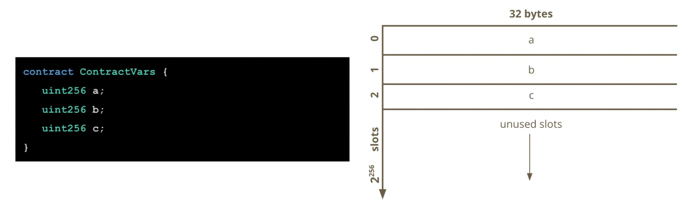
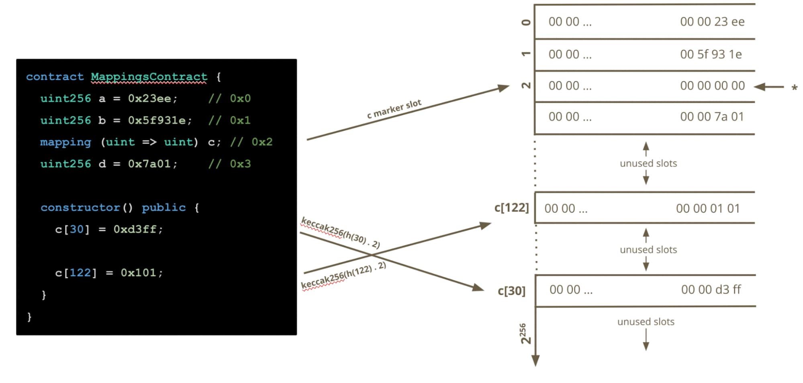

# EVM

在使用和学习 Solidity 以及 Ethereum 的时候，不可避免的会碰到 EVM，所以对 EVM 也做些深入的了解。

这里有篇深入介绍 EVM 的文章 (Diving Into The Ethereum Virtual Machine)

1. [中文翻译](https://github.com/AmazingAng/WTF-Solidity/blob/main/Topics/Translation/DiveEVM2017/readme.md)
2. [英文原文](https://blog.qtum.org/diving-into-the-ethereum-vm-6e8d5d2f3c30)

其他资源还有

- [The Ethereum Virtual Machine — How does it work?](https://medium.com/mycrypto/the-ethereum-virtual-machine-how-does-it-work-9abac2b7c9e)
- [What is Smart Contract Storage Layout?](https://docs.alchemy.com/docs/smart-contract-storage-layout)
- [WTF EVM Opcodes](https://github.com/WTFAcademy/WTF-EVM-Opcodes)
- [Ethereum EVM illustrated by Takenobu T.](https://github.com/takenobu-hs/ethereum-evm-illustrated)
- [Demystifying Ethereum Assembly by Joshua Riley](https://www.youtube.com/watch?v=btDOvn8pLkA)
- [evm-opcodes](https://github.com/wolflo/evm-opcodes)
- [evm-from-scratch](https://github.com/w1nt3r-eth/evm-from-scratch)
- [evm.codes](https://evm.codes/)
- Deep in EVM: [1](https://mirror.xyz/xyyme.eth/GNVcUgKAOEiLyClKeqkmD35ctLu6_XomT3ZDIfV3tz8), [2](https://mirror.xyz/xyyme.eth/6vqE2DRsMzlPNmh3kYiwTdMBj-9hanmxyDuTHM7tZDU), [3](https://mirror.xyz/xyyme.eth/dsU7KoQLyqiHrY0bQX2ETq1zkDYiW-3PtzxfzGwRdss)

## EVM 基础

EVM 的基本架构主要包括堆栈，内存，存储，EVM字节码，和燃料费。

EVM 基本的执行流程：

### EVM Storage Slot

合约的存储布局是指合约存储变量在内存中的布局规则，这种变量是需要长期存储的。

理解存储布局的好处：

1. 帮助我们写出节省 gas 的合约代码，因为 long-term 存储是昂贵的；
2. 能更好的理解和处理使用代理模式的合约；
3. 安全审计合约，如果不了解合约的存储布局，可能会使我们的合约容易收到攻击；

每个合约都有自己的存储区域，这些区域是一个持久化的、可读写的内存区域；合约只能读写自己的存储，不能访问其他合约的；合约的存储区域被划分为 `2^256` 个插槽，每个插槽 32 bytes；存储被初始化为 0；EVM 在每次读写的时候只能直接读写1个或多个插槽

由于合约存储的空间巨大，可以理解为这些存储布局的划分都是虚拟的(和虚拟内存-物理内存之间的关系是类似的)，实际上并不会分配那么多的插槽，每个合约只会记录实际上使用了哪些插槽(记录插槽的索引位置)，当访问一个没有分配的 slot 时，EVM 知道它没有分配出去，并返回 0

> **Solidity will automatically map every defined state variable of your contract to a slot in storage in the order the state variables are declared, starting at slot 0.**

上面的图非常清晰的展示了合约中的变量如何存储在 slot 中。

存储方式

整体上来看是按照变量的声明顺序挨个放在 slot 中，但是遇到一些特殊情况，EVM 会做一些优化和特殊处理

1. 小于 32 bytes 的变量，会 pad 0 后存入一个 slot 中
   1. 比如 bool, address, uint8, uint16 等
2. 打包变量
3. 结构体存储
4. 静态大小的数据存储
5. 动态类型的数据存储
   1. 在 Solidity 中动态类型的有 bytes, array, string 等
   2. 动态类型的标记 slot 存储的是数据的 size
   3. 实际的数据存储在 keccak256(marker slot number) 的 hash 对应的 slot 中，下个元素就是 keccak256(marker slot number) + 1 ...
6. mapping 的存储
   1. mapping 的存储更加复杂一些
   2. 首先会在声明位置的 slot 有个 marker
   3. 然后通过 keccak(h(n).p) 来计算给定 key 的存储位置
   4. 

