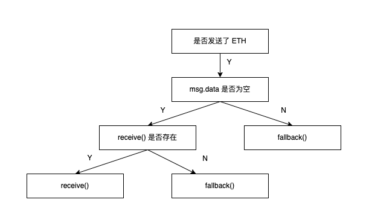

# 回退函数和发送 ETH

回退函数，有两种

1. fallback
2. receive

在以太坊合约中有 3 中方式可以发送 ETH 主币。

1. transfer
2. send
3. call

## fallback & receive

如果合约中定义了 fallback 和 receive 函数，在调用合约时没有对应的 method 的时候，就会自动调用 fallback 或 receive，他们的调用符合以下规则：



```solidity
// SPDX-License-Identifier: MIT

pragma solidity >=0.8.7 <0.9.0;

contract Fallback {
    event Log(string func, address sender, uint value, bytes data);

    fallback() external payable {
        emit Log("fallback", msg.sender, msg.value, msg.data);
    }

    receive() external payable {
        emit Log("receive", msg.sender, msg.value, "");
    }
}
```

## Send ETH

- transfer

在 solidity 的文档中描述，向地址类型发送数量为 amount 的 Wei，会发送 2300 gas 的矿工费，失败时会 revert，gas 大小不可调节

- send

在 solidity 的文档中描述，向地址类型发送数量为 amount 的 Wei，会发送 2300 gas 的矿工费，失败时会返回 bool (false), gas 大小不可调节

- call

在 solidity 的文档中描述，向地址类型发送数量为 amount 的 Wei,会发送所有可用 gas，return bool 和 data，gas 大小可调节

```solidity
// SPDX-License-Identifier: MIT

pragma solidity >=0.8.7 <0.9.0;

contract SendEther {
    constructor() payable { }

    // 合约接收主币
    receive() external payable { }

    function getBalance() external view returns (uint256) {
        return address(this).balance;
    }

    function sendViaTransfer(address payable _to) external payable {
        _to.transfer(123);
    }

    function sendViaSend(address payable _to) external payable {
        bool sent = _to.send(123);
        require(sent, "send failed");
    }

    function sendViaCall(address payable _to) external payable {
        (bool success, ) = _to.call{value: 123}("");
        require(success, "call failed");
    }
}

contract EthReceiver {
    event Log(uint amount, uint gas);

    receive() external payable {
        emit Log(msg.value, gasleft());
    }

    function getBalance() external view returns (uint256) {
        return address(this).balance;
    }
}
```

有几个点需要注意

1. 在使用 transfer / send / call 时，address 必须是 payable 的，如果 address 没有用 payable 修饰，可以考虑 payable(address) 来转换
2. 我们可以使用地址类型的 balance 来查询地址余额，比如 `<address>.balance` -> `address(this).balance`
3. call 可以指定传入的 gas 大小，这样指定 `_to.call{gas: 10000}("")`

## Reference

- [Solidity global variables](https://docs.soliditylang.org/en/v0.8.21/units-and-global-variables.html)
- [Solidity Address Type](https://docs.soliditylang.org/en/v0.8.21/types.html#address)